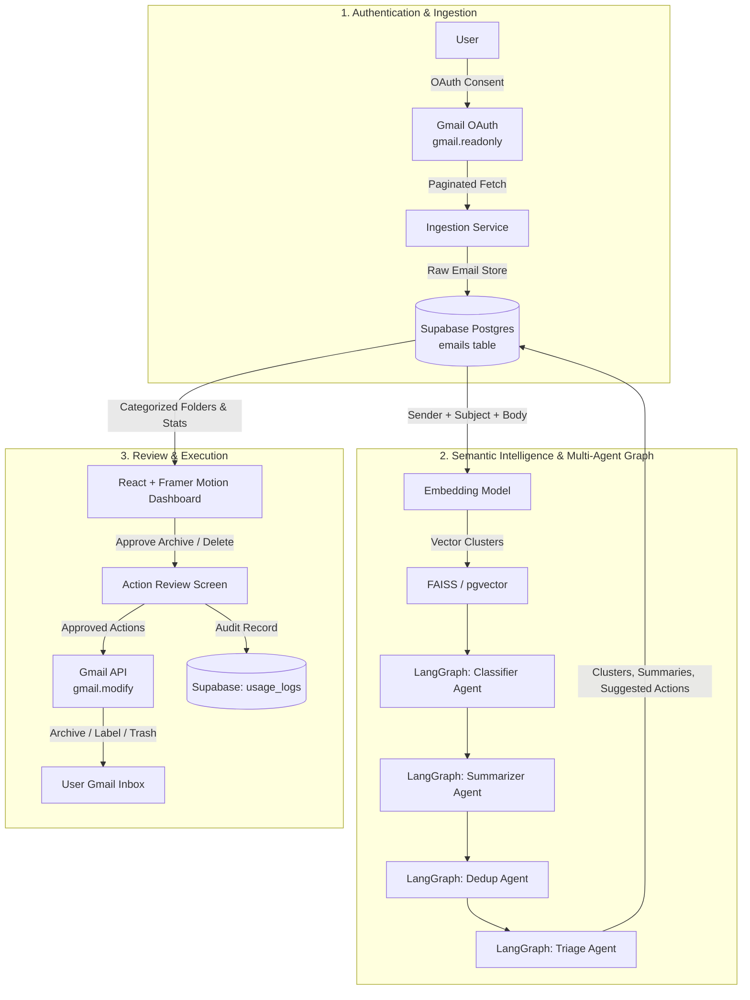
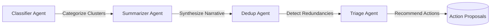
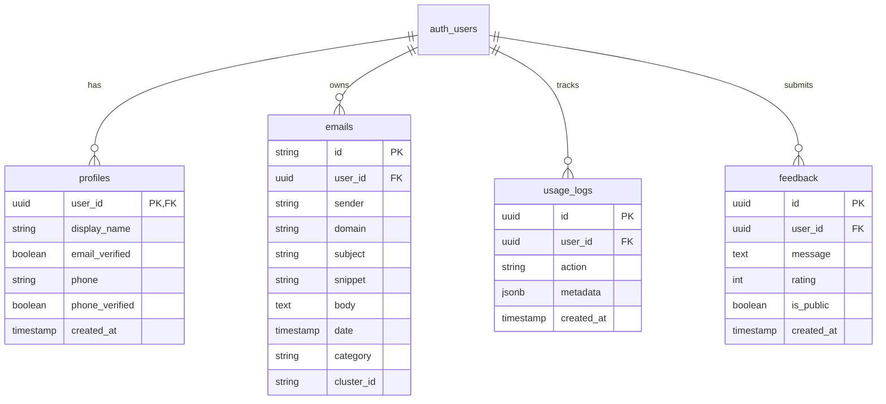
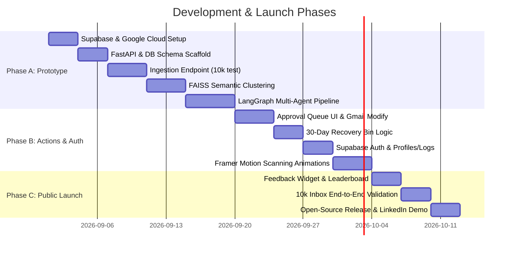

# [Project Name] 📬 🤖

> **AI Multi-Agent Gmail Sorting & Cleanup Assistant**  
> Connect your Gmail, understand your inbox at a narrative level, and safely reclaim storage without fear of losing critical emails.

[](https://fastapi.tiangolo.com/)
[](https://github.com/langchain-ai/langgraph)
[](https://supabase.com/)
[](https://react.dev/)
[](https://www.framer.com/motion/)
[](LICENSE)

---

## 📌 Notice on Project Name
> [!NOTE]
> The project name is currently set to the placeholder **`[Project Name]`** (or `[project-name]` / `[PROJECT_NAME]`). When you decide on a final name, run a project-wide find-and-replace to update this document and associated configs.

---

## 📖 Overview

Modern email inboxes easily accumulate tens of thousands of unread, uncategorized emails (10,000+ emails, often over 50% unopened). Existing solutions either apply shallow rule-based filters (sender/subject matches) or broad, generic AI tags (`newsletter`, `promotions`, `social`).

**[Project Name]** takes a fundamentally different approach:
1. **Deep Narrative Understanding:** It doesn't just tag your emails; it tells you what your inbox actually contains (e.g. *"62 emails from Unstop about hackathon reminders, 40 unopened"*).
2. **Organic Semantic Clustering:** Uses vector embeddings and semantic clustering to group emails into natural clusters without fragile, hardcoded filter rules.
3. **Safe, User-Approved Cleanups:** Implements an explicit approval queue and a 30-day recovery bin — no action ever executes without explicit confirmation.

---

## 🏗️ System Architecture & Data Flow



---

## 🤖 Multi-Agent Pipeline (LangGraph)

Instead of relying on a single monolith prompt, **[Project Name]** executes a specialized LangGraph multi-agent pipeline:



- **Classifier Agent:** Discovers semantic categories dynamically (e.g. Banking & Invoices, Recruitment & Hackathons, Subscriptions, Developer Newsletters).
- **Summarizer Agent:** Generates concise, human-readable narrative digests per cluster detailing count, date ranges, and core message intents.
- **Dedup Agent:** Identifies duplicate chains, automated drip emails, and repeated alert patterns across senders.
- **Triage Agent:** Suggests high-confidence, safe cleanup operations (archive vs. 30-day recovery bin vs. label) based on priority and engagement history.

---

## ⚡ Feature Matrix

### 🚀 Core MVP Features
- **Gmail OAuth (Read-Only First):** Connects with `gmail.readonly` initially to inspect the inbox without risking data loss.
- **Paginated Ingestion Engine:** Robust streaming and batch ingestion of email metadata and bodies into Supabase Postgres.
- **Semantic Vector Clustering:** Clusters sender, subject, and content with FAISS (or `pgvector`) to discover organic clusters without manual rules.
- **LangGraph Multi-Agent Pipeline:** Automated sequence of Classifier $\to$ Summarizer $\to$ Dedup $\to$ Triage agents.
- **Approval-Queue Actions:** Suggested archive and delete actions presented in an approval queue — nothing executes without explicit user approval.
- **Animated Dashboard UI:** Rich folder cards showing category, email count, narrative summary, and one-click action controls.

### 🔮 Phase 2 Features (Post-MVP)
- **Unsubscribe Suggestions:** Direct list-unsubscribe header resolution and one-click removal links.
- **Weekly Digest Email:** Automated weekly recap of cleaned emails, new clusters, and inbox health.
- **Action-Item Extraction:** AI secretary extraction for deadlines, OTPs, meeting dates, and interview requests.
- **Opt-in Storage-Freed Leaderboard:** Community metric dashboard celebrating space freed across users.
- **Undo / 30-Day Recovery Bin:** Soft-delete staging area before permanent deletion to guarantee peace of mind.
- **Teachable Category Rules:** Custom rules learned dynamically when a user corrects an agent's classification.

---

## 🛠️ Tech Stack

| Layer | Technology | Description |
| :--- | :--- | :--- |
| **Backend API** | [FastAPI](https://fastapi.tiangolo.com/) (Python) | High-performance asynchronous REST API and pipeline orchestrator |
| **Agent Orchestration** | [LangGraph](https://github.com/langchain-ai/langgraph) | State-machine multi-agent graph coordination |
| **Embeddings & Search** | FAISS / Supabase `pgvector` | Vector similarity indexing and semantic clustering |
| **Database** | [Supabase](https://supabase.com/) (PostgreSQL) | Managed PostgreSQL, row-level security, and fast API integration |
| **Authentication** | Supabase Auth | Secure session handling with mandatory email verification and optional phone OTP |
| **Frontend UI** | [React](https://react.dev/) + [Framer Motion](https://www.framer.com/motion/) | Animated dashboard, live scanning sequences, and animated counters |
| **Email Integration** | Google Gmail REST API | `gmail.readonly` during scan; `gmail.modify` for approved actions |

---

## 🗄️ Database Schema



---

## 📡 API Endpoints & Backend Workflow

| Method | Endpoint | Description | Auth Required |
| :--- | :--- | :--- | :--- |
| `POST` | `/auth/signup` | Register new user via Supabase Auth (Email confirmation triggered) | No |
| `POST` | `/auth/verify-otp` | Verify OTP token or email confirmation | No |
| `POST` | `/auth/login` | Authenticate user, set secure `httpOnly` JWT cookie | No |
| `GET` | `/connect-gmail` | Initiate Google OAuth 2.0 handshake for `gmail.readonly` | Yes |
| `GET` | `/oauth/callback` | Handle OAuth callback, securely persist refresh token | Yes |
| `POST` | `/scan` | Trigger background ingestion, vector clustering & LangGraph pipeline | Yes |
| `GET` | `/categories` | Fetch categorized clusters, narrative summaries, and stats | Yes |
| `POST` | `/actions/approve` | Execute user-approved archive/delete operations on Gmail API | Yes |
| `POST` | `/feedback` | Submit user feedback and optional star rating | Yes |
| `GET` | `/feedback` | List public approved testimonials (paginated) | No |

---

## 🗺️ Build & Launch Roadmap



### Phase A — Prototype (Read-Only, Personal Validation)
- [ ] Set up Supabase project (Auth + Postgres) and Google Cloud OAuth credentials (`gmail.readonly`).
- [ ] Scaffold FastAPI backend and React frontend shell.
- [ ] Implement email ingestion and verify ingestion on personal 10k-email inbox.
- [ ] Build FAISS embeddings & clustering pipeline; verify natural clusters.
- [ ] Build LangGraph agent graph (`Classifier -> Summarizer -> Dedup -> Triage`) and verify narrative readability.

### Phase B — Actions + Auth (Personal Dogfooding)
- [ ] Implement approval-queue UI with `gmail.modify` scope for archive/label actions.
- [ ] Implement 30-day recovery bin behavior before allowing permanent deletes.
- [ ] Wire Supabase Auth (mandatory email verification, optional phone).
- [ ] Add Framer Motion live sorting visualizer and animated statistic counters.

### Phase C — Public Demo + Launch
- [ ] Implement dashboard feedback widget and optional storage-freed leaderboard.
- [ ] Run full end-to-end demo on 10k inbox, record demo video of live scanning.
- [ ] Open-source repository with clean setup documentation.
- [ ] Publish launch post on LinkedIn highlighting real metrics (*"X emails sorted, Y MB freed"*).

---

## 🔒 Security & Privacy by Design

- **Least Privilege Access:** Authentication starts with read-only permissions (`gmail.readonly`). Write/modify permissions (`gmail.modify`) are requested only when the user explicitly triggers cleanup actions.
- **Zero Surprise Deletions:** All cleanup suggestions must pass through an approval queue.
- **Secure Token Management:** Gmail refresh tokens and JWT credentials are stored encrypted at rest with `httpOnly` secure cookies.
- **Reversible Operations:** Deletions route through a 30-day recovery bin to avoid inadvertent permanent data loss.

---

## 🚀 Getting Started

### 1. Prerequisites
- **Python:** 3.11+
- **Node.js:** 18.0+
- **Supabase Account:** [supabase.com](https://supabase.com)
- **Google Cloud Console Account:** with Gmail API enabled

### 2. Clone Repository
```bash
git clone https://github.com/your-username/[project-name].git
cd [project-name]
```

### 3. Environment Configuration
Create a `.env` file in the project root:

```env
# Supabase
SUPABASE_URL=https://your-project.supabase.co
SUPABASE_ANON_KEY=your_supabase_anon_key
SUPABASE_SERVICE_ROLE_KEY=your_supabase_service_role_key

# Google OAuth (Gmail API)
GOOGLE_CLIENT_ID=your_google_client_id.apps.googleusercontent.com
GOOGLE_CLIENT_SECRET=your_google_client_secret
GOOGLE_REDIRECT_URI=http://localhost:8000/oauth/callback

# LLM & Embedding Settings
OPENAI_API_KEY=your_openai_api_key_or_gemini_key

# App Config
SECRET_KEY=your_super_secret_jwt_key
ENVIRONMENT=development
```

### 4. Backend Setup
```bash
cd backend
python -m venv venv
source venv/bin/activate  # On Windows: .\venv\Scripts\activate
pip install -r requirements.txt
uvicorn main:app --reload --port 8000
```

### 5. Frontend Setup
```bash
cd frontend
npm install
npm run dev
```

---

## 📄 Documentation Reference
For the full engineering requirements document, see [docs/PRD.md](docs/PRD.md).

---

## 📜 License
Distributed under the MIT License. See `LICENSE` for more information.
